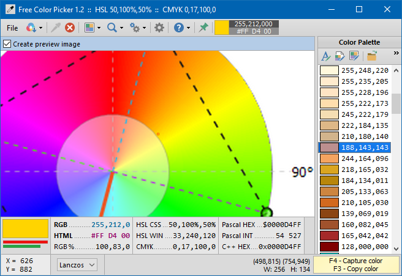
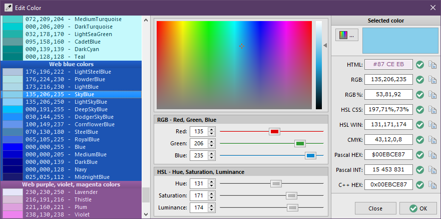
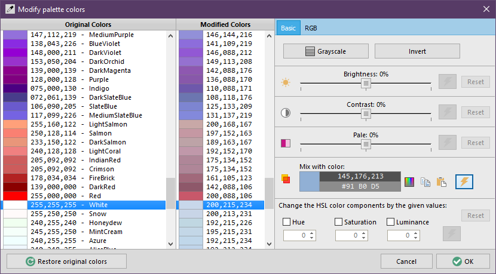
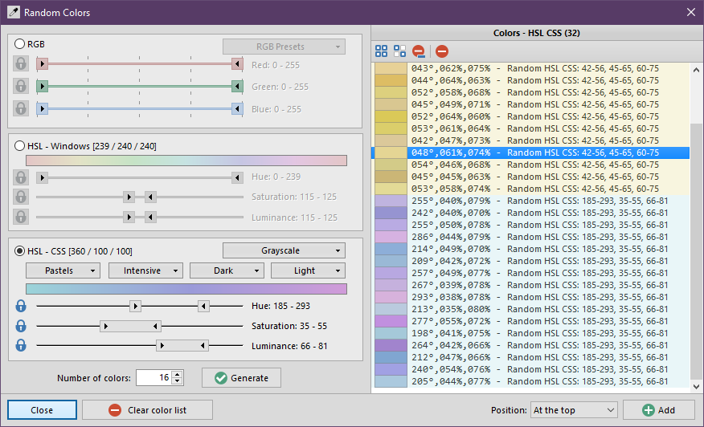

# Free Color Picker

Free Color Picker is a program that lets you capture the color of any pixel displayed on the screen. To capture a color, just move the cursor to the desired position and press the **F4** key. The color below the cursor will be added to the color palette located in the right part of the main window.

---

**The main window**

---

**Color dialog**

---

**Color wheel**

---

**Modify color palette**

---

**Random colors**

---

To facilitate color capturing, there is a screen magnifier in the center of the main window that displays an enlarged image around the current cursor position. The maximum magnification is 30x.

Any captured color can be changed freely using the built-in color editor. In addition, the program allows easy modification of the entire color palette, sorting according to various criteria, generating random colors for given ranges of RGB component colors, searching for triad colors on a color wheel and many more.

The most important functions of the program:
- Capturing the color of the pixel under the cursor (**F4** keyboard shortcut).
- Copy the color code under the cursor to the system clipboard in the format selected by the user (**F3** hotkey).
- Screen magnifier that enlarges the screen content around the current cursor position with a maximum magnification of 30x.
- The ability to set the algorithm used for zooming. The default algorithm - Box - does not change the color values. The other algorithms use color interpolation - they calculate the colors of empty pixels created after enlarging the image based on the colors of neighboring pixels in the original image. The most accurate, but also the slowest is the Lanczos algorithm.
- The ability to capture the pixel color at user-specified screen coordinates.
- Automatic capturing of color under the cursor at user-specified time intervals.
- The ability to pick-up colors from PNG, JPG, BMP and GIF graphic files opened in the program.
- Displaying color numeric codes and copying them in 9 popular formats used on websites and in various programming languages.
- Saving and loading color palettes in a proprietary format (JSON text files with the .colors extension) and in the format used by GIMP program (.gpl files).
- An advanced color palette editor that allows you to change the name and value of each color, sort, number, move, add and remove colors, insert colors from external files into the current palette.
- Advanced color palette sorting: by number, name, value, intensity of RGB channels, CMYK color space components (cyan, magenta, yellow, black) and HSL color space components (hue, saturation, brightness).
- The possibility of many modifications of the entire color palette: color conversion to grayscale, inversion, change of brightness, contrast, setting color fading, mixing each color of the palette with the selected color, changing the HSL components of each color by the given value, inversion of selected RGB channels, setting the value of selected channels RGB to a given fixed numeric value or their change by a given size.
- Generating random colors for user-specified ranges of RGB channel values and ranges of HSL component values.
- Generating gradient colors with given start and end colors.
- A color mixer calculating the color obtained after mixing the two colors given by the user.
- The color wheel of the HSL space with a graphical representation of the complementary, triadic and tetradic colors.
- *Drag and drop* support when opening color palette files and organizing colors in the *Color palette editor*.
- The ability to export a color palette to an HTML file with a color table for publication on websites.
- Built-in multi-language support mechanism based on INI text files with UTF-8 encoding. To write subsequent language versions, an ordinary text editor is sufficient, e.g. the system Notepad.
- The program is portable: it does not use the system registry, and all configuration data is saved in one INI file located in the program directory. The program can be copied to an external disk and used on another computer without any installation.
- The program is completely free, for private and commercial use.

---

*Free Color Picker* jest programem umożiwiającym przechwycenie koloru dowolnego piksela wyświetlanego na ekranie. Aby przechwycić kolor, wystarczy najechać kursorem na żądaną pozycję i wcisnąć klawisz **F4**. Kolor znajdujący się pod kursorem zostanie dodany do palety kolorów znajdującej się w prawej części okna głównego.

Aby ułatwić przechwytywanie kolorów, w części centralnej znajduje się lupa wyświetlająca powiększony obraz wokół bieżącej pozycji kursora. Maksymalne powiększenie wynosi 30x.

Każdy przechwycony kolor można dowolnie zmienić za pomocą wbudowanego edytora kolorów. Ponadto, program umożliwia łatwą modyfikację całej palety kolorów, sortowanie według różnych kryteriów, generowanie kolorów losowych dla podanych zakresów barw składowych, wyszukiwanie kolorów triady na kole barw i wiele innych.

Najważniejsze funkcje programu:
- Przechwytywanie koloru piksela znajdującego się pod kursorem (skrót klawiszowy F4).
- Kopiowanie kodu koloru pod kursorem do schowka systemowego w wybranym przez użytkownika formacie (skrót klawiszowy F3).
- Lupa ekranowa powiększająca zawartość ekranu wokół bieżącej pozycji kursora o maksymalnym powiększeniu wynoszącym 30x.
- Możliwość ustawienia algorytmu stosowanego przy powiększaniu. Domyślny algorytm - Box - nie zmienia wartości kolorów. Pozostałe algortytmy stosują interpolację barw - obliczają kolory pustych pikseli powstałych po powiększeniu obrazu na podstawie barw pikseli sąsiadujących w obrazie pierwotnym. Najdokładniejszym, ale też najwolniejszym, jest algorytm Lanczos.
- Możliwość przechwycenia koloru piksela o podanych przez użytkownika współrzędnych ekranowych.
- Cykliczne przechwytywanie koloru pod kursorem w określonych przez użytkownika interwałach czasowych.
- Możliwość pobierania kolorów z otworzonych w programie plików graficznych PNG, JPG, BMP i GIF.
- Wyświetlanie kodów liczbowych kolorów oraz ich kopiowanie w 9-ciu popularnych formatach wykorzystywanych na stronach www i w różnych językach programowania.
- Zapis i odczyt palet kolorów we własnym formacie (pliki tekstowe JSON z rozszerzeniem .colors) oraz w formacie używanym przez program GIMP (pliki .gpl).
- Zaawansowany edytor palety kolorów umożliwiający zmianę nazwy i wartości każdego koloru, sortowanie, numerowanie, przenoszenie, dodawanie i usuwanie kolorów, wstawianie do bieżącej palety kolorów z zewnętrznych plików.
- Zaawansowane sortowanie palety kolorów według numeru, nazwy, wartości, stopnia intensywności barw składowych RGB, komponentów składowych przestrzeni barw CMYK (cyjan, magenta, żółty, czarny) oraz komponentów składowych przestrzeni barw HSL (odcień, nasycenie, jasność).
- Możliwość rozmaitych modyfikacji całej palety kolorów: konwersja kolorów do skali szarości, inwersja, zmiana jasności, kontrastu, ustawienie blaknięcia kolorów, wymieszanie każdego koloru palety z wybranym kolorem, zmiana komponentów HSL każdego koloru o podaną wartość, inwersja wybranych kanałów RGB, ustawienie wartości wybranych kanałów RGB na podaną stałą wartość liczbową lub ich zmiana o podaną wielkość.
- Generowanie kolorów losowych dla podanych przez użytkownika zakresów barw składowych RGB oraz zakresów komponentów składowych HSL.
- Generowanie kolorów gradientu o podanym kolorze początkowym i końcowym.
- Mikser kolorów obliczający kolor powstały po wymieszaniu dwóch kolorów podanych przez użytkownika.
- Koło barw przestrzeni HSL z graficzną reprezentacją koloru dopełniającego, kolorów triady i prostokąta (tetradic colors).
- Obsługa techniki *Przeciągnij i Upuść* przy otwieraniu plików z paletami kolorów oraz porządkowaniu kolorów w *Edytorze palety kolorów*.
- Możliwość eksportu palety kolorów do pliku HTML z tabelą kolorów w celu publikacji na stronach internetowych.
- Wbudowany mechanizm obsługi wielu języków oparty na plikach tekstowych INI z kodowaniem UTF-8. Do napisania kolejnych wersji językowych wystarczy zwykły edytor tekstowy, np. systemowy *Notatnik*.
- Program jest przenośny (portable): nie wykorzystuje rejestru systemowego, a wszystkie dane konfiguracyjne zapisywane są w jednym pliku INI znajdującym się w katalogu z programem. Program można skopiować na dysk zewnętrzny i używać na innym komputerze bez żadnej instalacji.
- Program jest całkowicie darmowy, do użytku prywatnego i komercyjnego.

